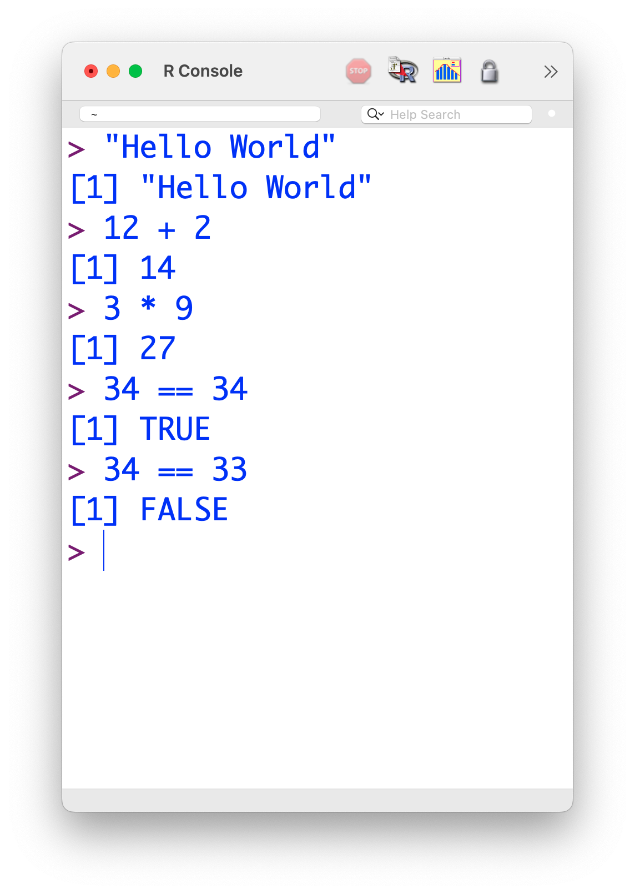
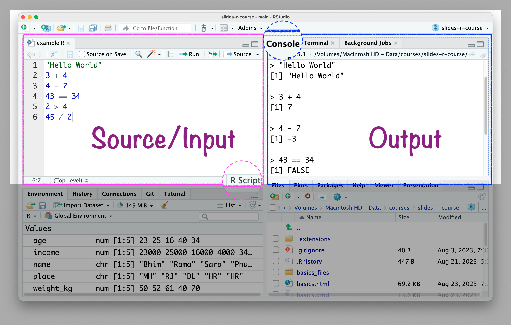

## Write codes in RStudio console {background-color=black}

{fig-align=center}

## Write codes in R script {background-color=black}

{fig-align=center}

## R script `.R`

> Write codes in the R script $\rightarrow$ Console will show the results.

-   Benefits of writing codes in R script:
    -   You can save it for later use and revision.
    -   You can share with others.
    -   A better track of codes.

## 💡 Tips for R script:

1.  Writing readable code because other people might need to use your code.

1.  Writing readable code because you might need to use your code, a few weeks/months/years after you've written it.

1.  Put spaces between and around variable names and operators (`=+-*/`).

1.  Break up long lines of code.

1.  Keeping a consistent style.

::: aside
Source: [Marius Mather](https://bookdown.org/marius_mather/Rad/tips-for-effective-r-programming.html) also [Tomaž Kaštrun](https://tomaztsql.wordpress.com/2023/01/31/tips-for-organising-your-r-code/)
:::

## {background-image=images/logo_quarto.png background-size=25%}

## 🤯 Your Turn {background-color=brown} 

### 1. What is R mainly used for? 

::: {.nonincremental}
A) Web browsing.    
B) Gaming.   
C) Data analysis and statistics.    
D) Drawing cartoons.    
:::

## 🤯 Your Turn {background-color=brown} 

### 2. What is RStudio?

::: {.nonincremental}
A) A video editing software
B) A web browser
C) An integrated development environment (IDE) for R
D) A spreadsheet tool    
:::

## 🤯 Your Turn {background-color=brown} 

### 3. What will 2 + 3 return in R?

::: {.nonincremental}
A) 5
B) 6
C) 23
D) Error    
:::

## 🤯 Your Turn {background-color=brown} 

### 4. Which of the following is used to create a sequence in R?

::: {.nonincremental}
A) list()
B) seq()
C) loop()
D) run()    
:::

## 🤯 Your Turn {background-color=brown} 

### 5. Where do you usually type your code in RStudio?

::: {.nonincremental}
A) Console or Script Editor
B) File Explorer
C) Toolbar
D) Help tab    
:::

## 🤩 Your Turn Answers {background-color=seagreen}

1. Correct answer: C) Data analysis and statistics

1. Correct answer: C) An integrated development environment (IDE) for R

1. Correct answer: A) 5

1. Correct answer: B) seq()

1. Correct answer: A) Console or Script Editor

## 🤯 Your Turn {background-color=brown} 

### 6. What symbol is used to assign a value to a variable in R?

::: {.nonincremental}
A) =
B) :=
C) <-
D) ==
:::

## 🤯 Your Turn {background-color=brown} 

### 7. Which function is used to view the structure of a dataset?

::: {.nonincremental}
A) str()
B) data()
C) view()
D) layout()
:::

## 🤯 Your Turn {background-color=brown} 

### 8. How do you read a CSV file into R?

::: {.nonincremental}
A) read.excel()
B) open.csv()
C) read.csv()
D) import()
:::

## 🤯 Your Turn {background-color=brown} 

### 9. Which package is commonly used for data visualization in R?

::: {.nonincremental}
A) dplyr
B) tidyr
C) ggplot2
D) readr
:::

## 🤯 Your Turn {background-color=brown} 

### 10. What is the shortcut to run a line of code in RStudio (on Windows)?

::: {.nonincremental}
A) Ctrl + C
B) Ctrl + Enter
C) Ctrl + R
D) Ctrl + S
:::

## 🤩 Your Turn Answers {background-color=seagreen}

1. Correct answer: C) <-

1. Correct answer: A) str()

1. Correct answer: C) read.csv()

1. Correct answer: C) ggplot2

1. Correct answer: B) Ctrl + Enter
