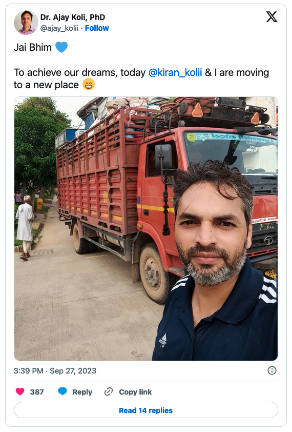
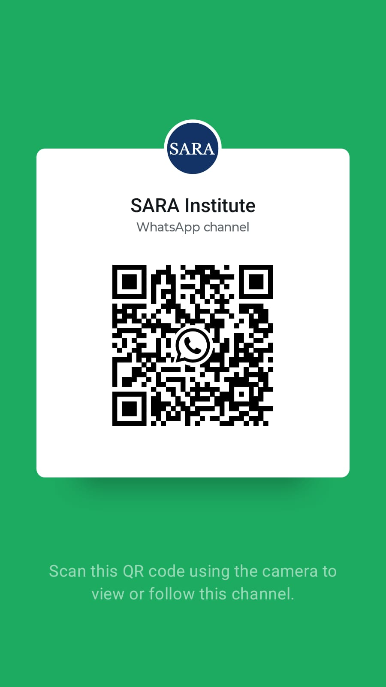

# Welcome! {background-image="images/thanks/thanks-3sss.png" background-size="contain" background-position="right"}

## {.center-slide}

:::::: columns
::: {.column width="35%"}
{fig-alt="Sara's headshot" fig-align="center" width=250px style="border-radius: 50%;"}

#### Savitribai Phule (1831-1897) 🌺 🙏🏽🌼

:::

::: {.column width="30%"}

{width="2.0in" fig-align="center"}
:::

::: {.column width="35%"}
{fig-alt="Sara's headshot" fig-align="center" width=250px style="border-radius: 50%;"}

#### Ramabai Ambedkar (1898-1935) 🌺 🙏🏽🌼
:::
::::::

[**Savitribai Ramabai (SARA) Institute of Data Science, Sonipat**]{.r-fit-text .muted}

## About SARA {background-image="https://images.unsplash.com/vector-1754288532523-0f0f5e988cf5?q=80&w=1412&auto=format&fit=crop&ixlib=rb-4.1.0&ixid=M3wxMjA3fDB8MHxwaG90by1wYWdlfHx8fGVufDB8fHx8fA%3D%3D" background-size="50%" background-position="bottom right"}

> Since 2023, we believe coding is for everyone.

::: {.columns}

::: {.column width="60%"}

- Provides free open-source data science education
- Priority admission for marginalised communities & women
- Promoting AI Awareness

:::

::: {.column}

:::

:::

## SARA Data Schools {background-color="#003262"}

::: {.panel-tabset}

### Summer School

::: {#fig-summer layout-ncol=2}

{#fig-surus}

{#fig-hanno}

Participants of the SARA Summer Schools "R for Researchers"
:::

### Winter School 

::: {#fig-winter layout-ncol=2}

{#fig-surus}

{#fig-hanno}

Participants of the SARA Winter Schools "Statistics using R"
:::

### Bootcamp

::: {#fig-bootcamp layout-ncol=2}

{#fig-surus}

{#fig-hanno}

Participants of the SARA Coding Bootcamps "Publish using Quarto"
:::

::: 

## 3rd SARA Summer School {background-color="#003262" .center-slide}

## 3rd SARA Summer School

- 5 day, 40 hours, free data science education

- Five guest speakers gave free expert sessions

- 15 participants attended from UG to PhD level
    - [7 participants fully funded.]{.highlight}
    - 7 participants early-bird Rs.2700.
    - 1 participants regular price Rs.4500.

# Participant's Feedback {.center-slide}
[Learning experience $\cdot$ Food & stay experience $\cdot$ Message for community]{.r-fit-text}

## {background-image="images/thanks/participants/vaishnavi.svg" background-size="cover"}

## {background-image="images/thanks/participants/ashok.svg" background-size="cover"}

## {background-image="images/thanks/participants/rajat.svg" background-size="cover"}

## {background-image="images/thanks/participants/dhano.svg" background-size="cover"}

## {background-image="images/thanks/participants/aish.svg" background-size="cover"}

## {background-image="images/thanks/participants/roshan.svg" background-size="cover"}

## {background-image="images/thanks/participants/dalphin.svg" background-size="cover"}

## {background-image="images/thanks/participants/priya.svg" background-size="cover"}

## {background-image="images/thanks/participants/kajal.svg" background-size="cover"}

## {background-image="images/thanks/participants/vidha.svg" background-size="cover"}

## {background-image="images/thanks/participants/pooja.svg" background-size="cover"}

## {background-image="images/thanks/participants/achal.svg" background-size="cover"}

## {background-image="images/thanks/participants/yogi.svg" background-size="cover"}

## {background-image="images/thanks/participants/tushar.svg" background-size="cover"}

## {background-image="images/thanks/participants/rajeshri.svg" background-size="cover"} 

# SARA  Speaker {background-image="images/thanks/shivani.png" background-size="contain" background-position="right" background-color="#003262"}

# SARA  Speaker {background-image="images/thanks/nikee.png" background-size="contain" background-position="right" background-color="#003262"}

# 📣 New Announcements

## Bridge Course Level 1

 

> A free, offline foundational education programme to build the academic base needed for higher education. 

. . .

> It will be open to anyone who has been denied quality education and ready to claim it.

## Bridge Course Level 1 

::: {.columns}

::: {.column .nonincremental}

@. Social Science
@. Science
@. Geography
@. History
@. English Language

:::

::: {.column .nonincremental}

@. Environmental Science
@. Mathematics
@. General Knowledge
@. Civics, polity & political economy
@. Computer & AI

:::

:::

## SARA Book Club {.center-slide background-color="#003262"}

::: footer
More info: <https://sara-edu.netlify.app/book-club/books-donation/sara_book_donations>
:::

# The Ambedkar Educational Society Sonipat (HR) 1969 {.center-slide background-image="images/thanks/sonipat-bhawan.png" background-size="25%" background-position="50% 10%"}

## {background-image="images/thanks/president.png" background-size="contain"}

# The Ambedkar Educational Society Sonipat (HR) 1969 {.center-slide background-image="images/thanks/sonipat-bhawan.png" background-size="25%" background-position="50% 10%"}

# {background-image="images/thanks/upi-sara.png" background-size="contain" background-position="right" background-color="#003262"}

{fig-align="left"}

## SARA on Social Media {background-color="#003262"}

:::::: columns
::: {.column .centering width="25%"}

 

:::

::: {.column width="10%"}
:::

::: {.column  width="65%"}
 
 
   925 315 2024     
[sara.institute.info\@gmail.com](mailto:%20sara.institute.info@gmail.com)
     <https://sara-edu.netlify.app/>

  Follow SARA on Social Media. 

[](https://github.com/sara-edu)  
[](https://twitter.com/sara_institute)  
[](https://www.facebook.com/profile.php?id=61564043738390)
  [](https://www.youtube.com/@SARADataScience)
 
[](https://www.linkedin.com/company/sara-institute/)
 
[](https://whatsapp.com/channel/0029Va4r7rGLCoWycMwThl2J)
 
[](https://www.instagram.com/sara_data_sci/)
:::
::::::

# Thank You {background-image="images/thanks/upi-sara.png" background-size="contain" background-position="right" background-color="#003262"}
 Group Picture 🩵 Dinner

