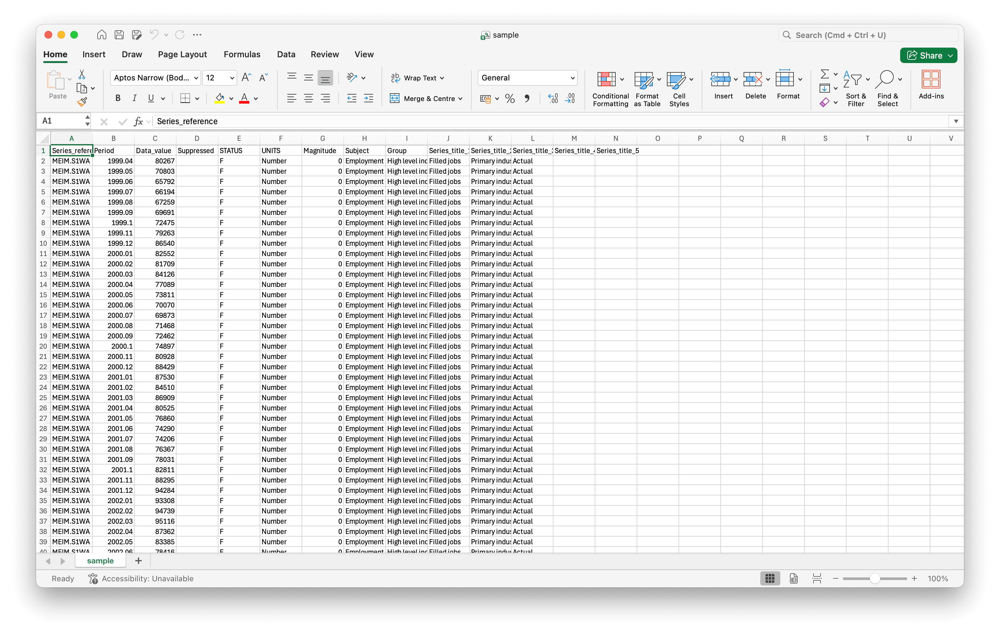
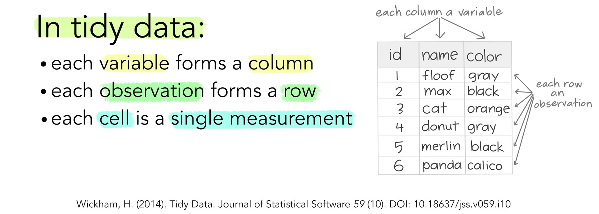
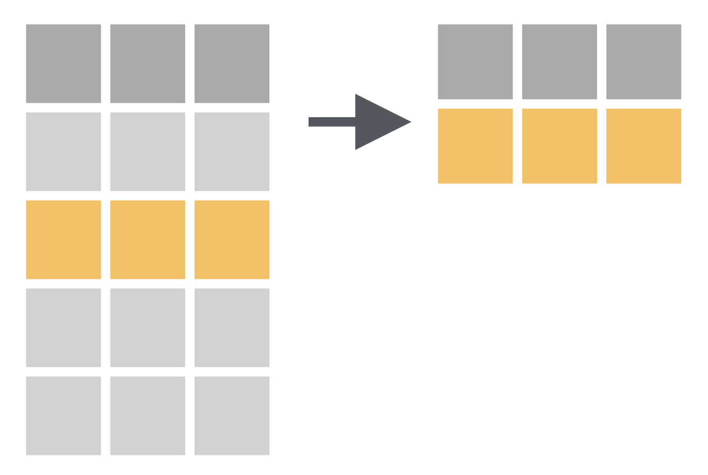
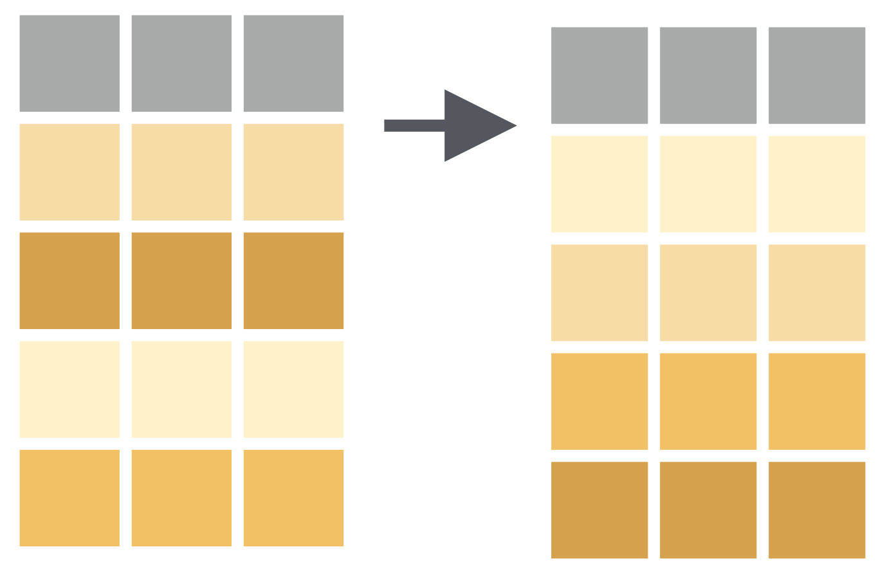
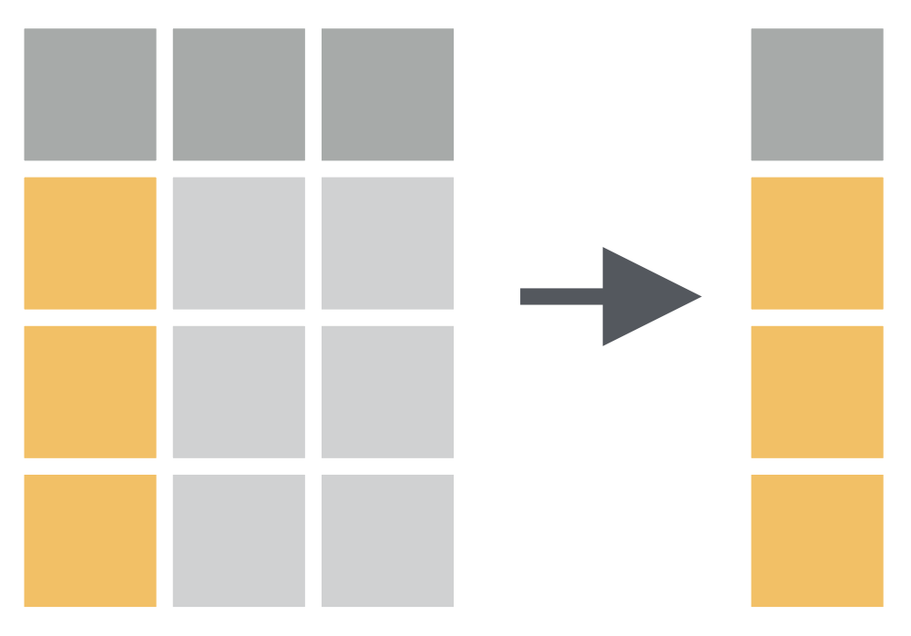
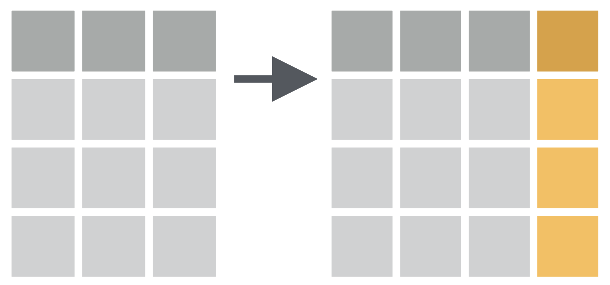
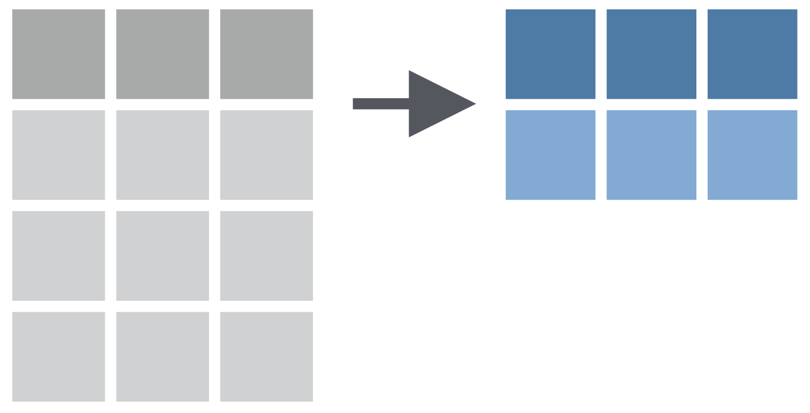

## Data {background-color="black"}



## Data Structure {background-color="black"}

<br>


## Tidy Data Structure {background-color="black"}

<br>



::: footer
Image source: [Allison Horst](https://allisonhorst.com/other-r-fun)
:::

## Data Value Types

<br>

| Data type | Example Values       | Column Type   |
|-----------|----------------------|:-------------:|
| Logical   | TRUE, FALSE          | `lgl`         |
| Integer   | 1L, 4L, 10L          | `int`         |
| Double    | 1.5, 12, 5.6         | `dbl`         |
| Character | "A", "B", "A"        | `chr`         |
| Factor    | factor("A", "B")     | `fct`         |

::: footer
Learn more <https://tibble.tidyverse.org/articles/types.html>
:::

## What we will cover

1. Data Import (`readr`, `readxl`)

1. First Look at Data (`dplyr`, `skimr`, `janitor`)

1. Data Cleaning (`janitor`, `tidyr`)

1. Data Transformation (`dplyr` verbs)

## Setup

- [ ] You are working in a RStudio project

- [ ] Create a quarto (`.qmd`) file

- [ ] Create an HTML output of this quarto file

## Load R Packages

```{r}
#| label: load-packages
library(here) # to reduce broken file paths
library(tidyverse) # core tidyverse (dplyr, tidyr, readr, ggplot2, ...)
library(readxl) # import Excel files
library(janitor) # clean column names, tabyl
library(skimr) # quick data summaries
```

::: {.tip-box .fragment}
Install any missing package with `install.packages("package_name")`
:::

## `here` Package {background-color=black}

{fig-align="center" width="70%"}

::: footer
Image artist: [Allison Horst](https://allisonhorst.com/allison-horst)
:::

## `here` Package {background-image="https://raw.githubusercontent.com/allisonhorst/stats-illustrations/master/rstats-artwork/here.png" background-size="30%" background-position="right bottom"}

- "to enable easy file referencing in projects"

- "uses the top-level directory of a project to easily build paths to files"

::: footer
More info: <https://here.r-lib.org/>
:::

# DATA<br>IMPORTING

## Import a Local CSV file

The `readr` package reads rectangular data files.

<br>

```{r}
#| label: import-data
sample_data <- read_csv(here("data", "sample.csv"))
```

::: footer
Data source: <https://www.stats.govt.nz/large-datasets/csv-files-for-download/>
:::

## View your Data

<br>

```{r}
#| label: view-data
#| output-location: fragment
#| echo: true

sample_data
```

## Import with column type control

<br>

```{r}
#| label: import-col-types
#| eval: false

data <- read_csv(
  "path/to/data.csv",
  col_types = cols(
    name = col_character(),
    age = col_integer(),
    edu = col_factor("PhD", "PG", "UG", "12th", "10th"),
    income = col_double(),
    date = col_date(format = "%Y-%m-%d")
  )
)
```

## Common `read_*` functions

<br>

| Function | File type |
|---|---|
| `read_csv()` | Comma-separated (.csv) |
| `read_tsv()` | Tab-separated (.tsv) |
| `read_delim()` | Any delimiter |
| `read_excel()` | Excel (.xlsx, .xls) |
| `read_rds()` | R binary (.rds) |

## Your Turn {.your-turn}

```{r}
#| echo: false
library(countdown)

countdown(minutes = 10, play_sound = TRUE, top = 0)
```

1. Install the `palmerpenguins` package.

1. Load/call the `palmerpenguins` package.

1. View the `penguins` dataset.

1. What data types are the columns/variables?

## Answers {.answer}

```{r}
#| output-location: fragment
# to install a package
# install.packages("palmerpenguins")

# to call/load a package
library(palmerpenguins)

# to load the data
penguins
```

# FIRST LOOK<br>AT DATA

## Dimensions of Data

- Total number of rows = Sample size

- Total number of columns = Variables

## Sample Size & Variables in Data 

```{r}
#| label: first-look-number-row-cols
#| output-location: fragment
# Dimensions rows/sample-size & columns/total-variables
dim(penguins)
```
<br>

::: {.fragment}

### Only sample size
```{r}
#| label: first-look-only-row
#| output-location: fragment
# only rows
nrow(penguins)
```

:::

<br>

::: {.fragment}

### Only variables
```{r}
ncol(penguins)
```

:::

## Variables in `penguins` data

<br>

```{r}
names(penguins)
```

## Species of Penguins


::: footer
More info: <https://allisonhorst.github.io/palmerpenguins/>
:::

## Bill data of Penguins


## Top of the Data using `head()` 

```{r}
#| label: first-look-head
#| output-location: fragment
# First 6 rows
head(penguins)
```

## Bottom of the Data using `tail()`

```{r}
#| label: first-look-tail
#| output-location: fragment
# bottom 6 rows
tail(penguins)
```

## Data overview using `glimpse()`

```{r}
#| label: first-look-glimpse
#| output-location: fragment
# Compact column-wise view
glimpse(penguins)
```

## Summary using `summary()`

```{r}
#| label: first-look-summary
#| output-location: fragment
# column-wise summary
summary(penguins)
```

## Rich Summary using `skim()`

```{r}
#| label: skim-data
#| output-location: fragment
# using package skimr
skim(penguins)
```

## Frequency Tables using `count()`

```{r}
#| label: count
penguins |>
  count(species, sort = TRUE)
```

## Beautiful Tables

```{r}
#| output-location: slide
#| echo: fenced
#| label: tbl-species
#| tbl-cap: "Species wise total number of penguins."
#| tbl-cap-location: bottom
library(kableExtra)

penguins |>
  count(species, sort = TRUE) |>
  kbl(col.names = c("Species", "Number of Penguins")) |>
  kable_styling()
```

::: footer
More info [kableExtra](https://haozhu233.github.io/kableExtra/awesome_table_in_html.html)
:::

## Wait! What is `|>` 

- This is called native **pipe** operator

- `|>` let you "pipe" an object forward to a function or call expression

- allowing you to express a sequence of operations that transform an object.

- ctrl + shift + m = `|>`

::: footer
Read more about pipes [here](https://www.tidyverse.org/blog/2023/04/base-vs-magrittr-pipe/)
:::

## Your Turn {.your-turn}

Using the `penguins` dataset:

1. Use `skim()` to get a summary. 

1. How many missing values in each variable?

1. Count how many penguins are on each island.

1. Count penguins of each `sex` exist per `species`.

## Answers {.answer}


```{r}
penguins |>
  count(species, sex)
```

# DATA<br>CLEANING

## Messy Variable Names

```{r}
names(sample_data)
```

. . .

- Spaces, 
- Capital letters, 
- Special characters

## Messy Dataset

```{r}
#| label: clean-names
#| output-location: fragment
# Simulating messy column names
messy <- tibble(
  "First Name" = c("Priya", "Rahul", "Sunita"),
  "AGE (Years)" = c(25, 32, 28),
  "Test Score%" = c(88, 91, 76)
)

messy #view dataset
```

## Package `janitor` {background-color="black"}


::: footer
Image artist: [Allison Horst](https://allisonhorst.com/allison-horst)
:::

## Clean Column Names with `janitor`

::: {.columns}

::: {.column}
### Before
```{r}
#| output-location: fragment
sample_data |>
  names()
```

:::

::: {.column  .fragment}
### After

```{r}
#| output-location: fragment
sample_data |>
  clean_names() |>
  names()
```

:::

:::

## Clean Column Names with `janitor`

::: {.columns}

::: {.column}
### Before
```{r}
#| output-location: fragment
messy |>
  names()
```

:::

::: {.column  .fragment}
### After

```{r}
#| output-location: fragment
messy |>
  clean_names() |>
  names()
```

:::

:::

## Missing Values `NA`

```{r}
#| label: missing-values-glimpse
# see NAs with any column
penguins |>
  glimpse()
```

## Missing Values `NA`

```{r}
#| label: missing-values-summary
# see NAs with any column
penguins |>
  summary()
```

## Removing Missing Values

```{r}
#| label: remove-missing-values
#| output-location: fragment
#| code-line-numbers: "7"
# Remove NAs in specific columns only
penguins |>
  drop_na() |>
  summary()
```

## Specific Column Missing Values 

```{r}
#| label: handle-missing-values-column
#| output-location: fragment
#| code-line-numbers: "7"
# Remove NAs in specific columns only
penguins |>
  drop_na(bill_length_mm) |>
  summary()
```

## Remove Duplicates

```{r}
#| label: duplicates
# Check for duplicate rows
penguins |>
  distinct() |>
  nrow()
```

. . .

```{r}
# Distinct on specific columns
penguins |>
  distinct(species, island)
```

## Rename Columns

```{r}
#| label: rename
#| code-line-numbers: "5-8"
penguins |>
  rename(
    sex_penguins = sex,
    species_penguins = species
  ) |>
  glimpse()
```


## Your Turn {.your-turn}

Using `penguins`:

- Drop rows where `body_mass_g` or `sex` is missing.

- Rename `bill_length_mm` to `bill_length` and `bill_depth_mm` to `bill_depth`.

## Answers {.answer}

```{r}
#| output-location: fragment
# Drop rows where body_mass_g or sex is missing
penguins |>
  drop_na(body_mass_g, sex) |>
  summary()
```


## Answers {.answer}

```{r}
#| output-location: fragment
# Rename `bill_length_mm` to `bill_length` and `bill_depth_mm` to `bill_depth`.
penguins |>
  rename(
    `bill_length` = `bill_length_mm`,
    `bill_depth` = `bill_depth_mm`
  ) |>
  names()
```

# DATA<br>TRANSFORMATION

## Data Transformation

> "to create some new variables or summaries ... to rename the variables or reorder the observations"

. . .

### `dplyr` package

{width=25%}

::: footer
Sources: <https://r4ds.hadley.nz/data-transform.html>
:::

## `dplyr` basics

1. The first argument is always a data frame.

1. The subsequent arguments typically describe which columns to operate on using the variable names (without quotes).

1. The output is always a new data frame.

::: footer
Sources: <https://r4ds.hadley.nz/data-transform.html>
:::

## Primary `dplyr` verbs:

<br>

| Verb | What it does |
|---|---|
| `filter()` | Keep rows matching a condition |
| `select()` | Keep or drop columns |
| `mutate()` | Add or change columns |
| `arrange()` | Sort rows |
| `summarise()` | Collapse rows to summaries |
|`group_by()`|  Combine for grouped operations |

## `filter()` function - Subset rows

> ["allows you to keep rows based on the values of the columns"]{.r-fit-text}



## `filter()` function

```{r}
# Single condition factor
penguins |>
  filter(sex == "male")
```

## `filter()` function

```{r}
# Single condition numeric
penguins |>
  filter(body_mass_g >= 5000)
```

## `filter()` function

```{r}
# multiple conditions
penguins |>
  filter(species == "Gentoo", body_mass_g > 1000, bill_length_mm > 45)
```

## `filter()` function

```{r}
# or conditions
penguins |>
  filter(species == "Gentoo" | body_mass_g > 4000)
```

## `filter()` function

::: {.panel-tabset}
### Task

How to have a data of only male penguins?

{width=50%}

### Code

```{r}
#| label: filter-fun
#| eval: false
penguins_male <- penguins |>
  filter(sex == "male")

penguins_male
```

### Output

```{r }
#| label: filter-fun
#| echo: false
```

:::

## `filter()` function

::: {.panel-tabset}
### Task

How to have a data of penguins of bill length more than 43 mm?

{width=50%}

### Code

```{r}
#| label: filter-fun2
#| eval: false
penguins |>
  filter(bill_length_mm > 43)
```

### Output

```{r }
#| label: filter-fun2
#| echo: false
```

:::

## Your Turn {.your-turn}

```{r echo=FALSE}
countdown(minutes = 10, play_sound = TRUE, top = 0)
```

- How to have a data of only Adele penguins?

- How to have a data of penguins of bill depth more than 10 mm?

## Answer {.answer .scrollable}

```{r}
#| label: your-turn6
#| output-location: fragment
# question number 1
penguins |>
  filter(species == "Adelie")
```

## Answer {.answer .scrollable}

```{r}
#| output-location: fragment
# question number 2
penguins |>
  filter(bill_depth_mm > 20)
```


## `arrange()` function - Sort rows

> ["changes the order of the rows based on the value of the columns"]{.r-fit-text}



## `arrange()` function

```{r}
#| label: arrange
# Ascending (default)
penguins |>
  arrange(body_mass_g)
```

## `arrange()` function

```{r}
#| label: arrange-desc
# Descending
penguins |>
  arrange(desc(body_mass_g))
```

## `arrange()` Function

::: {.panel-tabset}
### Task

> How to arrange data as per the bill length of the penguins?

### Code

```{r}
#| label: arrange-fun1
#| eval: false
penguins |>
  arrange(bill_length_mm) #default is ascending order
```

### Output

```{r }
#| label: arrange-fun1
#| echo: false
```

:::

## `arrange()` Function

::: {.panel-tabset}
### Task

> How to see five penguins of the least bill length?

### Code

```{r}
#| label: arrange-fun2
#| eval: false
#| code-line-numbers: "3"
penguins |>
  arrange(bill_length_mm) |>
  head(5)

#tail function to see the bottom of the data
```

### Output

```{r }
#| label: arrange-fun2
#| echo: false
```

:::

## `select()` function - Choose columns

> "picks variables/columns based on their names"



## `select()` function

```{r}
# select by name
penguins |>
  select(sex, year, species, island)
```

## `select()` function

```{r}
# drop columns
penguins |>
  select(-sex, -island, -bill_depth_mm)
```

## Tips for variable selection

::: {.tip-box}

- Use `names()` function to see the exact names and the order of the variables.

- Use `:` operator to select the range of variables.
:::

## `select()` function

```{r}
#| output-location: fragment
# name and order of the variables/columns
names(penguins)
```

. . .

```{r}
#| output-location: fragment
# sequence of variables
penguins |>
  select(island:flipper_length_mm)
```

. . .

```{r}
#| output-location: fragment
# Use location value of the variable.
penguins |>
  select(3:7)
```

. . .

```{r}
#| output-location: fragment
# Use `-` operator to not to select the range of variables.
penguins |>
  select(-c(island:flipper_length_mm))
```

## [`mutate()` function - Create or change columns]{.r-fit-text}

> Adds new variables using existing variables.



## `mutate()` Function

::: {.panel-tabset}
### Task

> How to convert body mass of penguins from grams to kilograms?

### Code

```{r}
#| label: mutate-fun1
#| eval: false
penguins |>
  select(sex, species, body_mass_g) |>
  mutate(body_mass_kg = body_mass_g / 1000)
```

### Output

```{r }
#| label: mutate-fun1
#| echo: false
```

:::

## `mutate()` Function

::: {.panel-tabset}
### Task

> How to measure the penguin's bill size using length and depth?

### Code

```{r}
#| label: mutate-fun2
#| eval: false
penguins |>
  mutate(bill_size = bill_length_mm * bill_depth_mm) |>
  select(bill_size)
```

### Output

```{r }
#| label: mutate-fun2
#| echo: false
```

:::

## `summarise()` function

> Reduces multiple values down to a single summary.



## `summarise()` function

::: {.panel-tabset}
### Task

> What is the mean bill length of penguins?

### Code

```{r}
#| label: summarise-fun1
#| eval: false
#| code-line-numbers: "3"
penguins |>
  summarise(mean(bill_length_mm))
```

### Output

```{r }
#| label: summarise-fun1
#| echo: false
```

:::

## `summarise()` function

::: {.panel-tabset}
### Task

> What is the mean bill length of penguins after removing the missing values?

### Code

```{r}
#| label: summarise-fun2
#| eval: false
#| code-line-numbers: "2"
penguins |>
  drop_na() |>
  summarise(mean(bill_length_mm))
```

### Output

```{r }
#| label: summarise-fun2
#| echo: false
```

:::

## `summarise()` + `group_by()` function

::: {.panel-tabset}
### Task

> What is the species wise mean bill length of penguins?

### Code

```{r}
#| label: summarise-fun3
#| eval: false
#| code-line-numbers: "3"
penguins |>
  drop_na() |>
  group_by(species) |>
  summarise(mean(bill_length_mm))
```

### Output

```{r }
#| label: summarise-fun3
#| echo: false
```

:::

## `summarise()` + `group_by()` function

::: {.panel-tabset}
### Task

> What is the species wise mean bill length of penguins and total number of penguins in each specie?

### Code

```{r}
#| label: summarise-fun4
#| eval: false
#| code-line-numbers: "3"
penguins |>
  drop_na() |>
  group_by(species) |>
  summarise(mean(bill_length_mm), n = n())

# n() function to know the number of observations in the current group
```

### Output

```{r }
#| label: summarise-fun4
#| echo: false
```

:::

## Beautiful Tables

```{r}
#| output-location: slide
#| label: tbl-avg-bill
#| tbl-cap: "Species wise average bill length and depth."
#| tbl-cap-location: margin
peng_table <- penguins |>
  drop_na() |>
  group_by(species) |>
  summarise(
    round(mean(bill_length_mm), 2),
    round(mean(bill_depth_mm), 2),
    n = n()
  )

peng_table |>
  kbl(
    col.names = c(
      "Species",
      "Average Bill Length (mm)",
      "Average Bill Depth (mm)",
      "Number of penguins"
    )
  ) |>
  kable_styling()
```

## Thank you! {.center}

**Module 2 complete** 🎉

*SARA Institute of Data Science - 3rd SARA Summer School 22-26 July 2026 "R for Researchers"*

::: {.footer}
Course Slides website: <https://sara-course-r4b.netlify.app/>
:::
