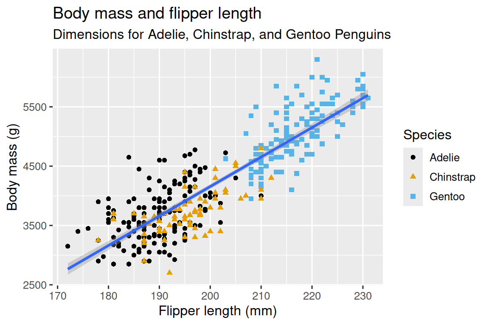
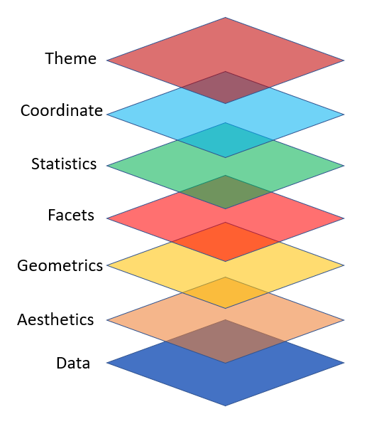
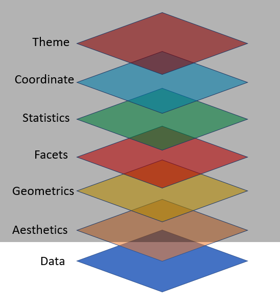
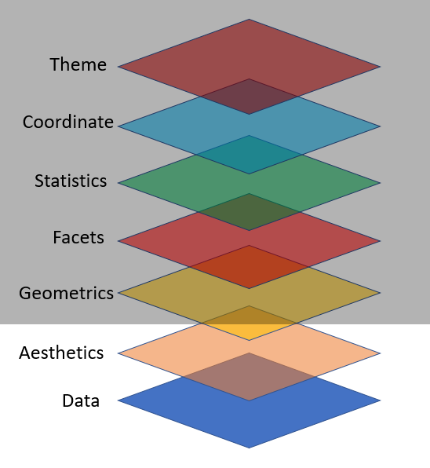
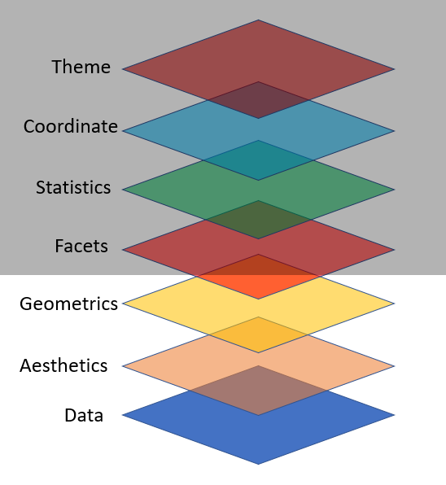

## Data Visualization

<br>

> "The simple graph has brough more information to the data analyst's mind than any other device." - John Tukey

## Climate Spiral {background-color="black"}




::: {.footer}
Source: [NASA Climate Change](https://youtu.be/jWoCXLuTIkI?si=PltjZGbujplNq27B)
:::

## The R Graph Gallery {background-color="black"}

<br>

<iframe src="https://r-graph-gallery.com/index.html" width="100%" height="500px" title="Embedded Webpage" style="border:none;"></iframe>

::: {.footer}
Source: [Yan Holtz](https://r-graph-gallery.com/)
:::

## Computational Art {background-color="black"}

<br>

<iframe src="https://art.djnavarro.net/gallery/" width="100%" height="500px" title="Embedded Webpage" style="border:none;"></iframe>

::: {.footer}
Source: [Danielle Navarro](https://art.djnavarro.net/gallery/)
:::

## Grammar of Graphics {background-image="images/logo-ggplot.png" background-size="25%" background-position="90%"}


::: {.columns}

::: {.column width="60%"}

<br>

- "`ggplot2` implements **grammar of graphics**, a coherent system for describing and building graphs"

:::

::: {.column}


:::

:::

::: {.footer}
Source: <https://r4ds.hadley.nz/data-visualizehttps://r4ds.hadley.nz/data-visualize>
:::

## Set-up

<br>

```{r}
#| label: set-up-data-viz
#| echo: fenced
library(palmerpenguins) # to access peguins data

# to access ggplot2 package
library(tidyverse)
```

## Know your Data

<br>

```{r}
glimpse(penguins)
```

## Ultimate Goal {background-color="black"}



## {background-image=images/layer3d.png background-size=contain background-color=#000}

## ggplot2 Layers {background-color="black"}



## Import Data

::: {.panel-tabset}
### Task

{width=35%}

### Code

```{r}
#| label: import-data
#| eval: false

ggplot(data = penguins)
```

### Output

```{r }
#| label: import-data
#| echo: false
```

:::

## Map Variables Aesthetics

::: {.panel-tabset}
### Task

{width=35%}

### Code

```{r}
#| label: map-var
#| eval: false
#| code-line-numbers: "2"

ggplot(data = penguins, 
        mapping = aes(x = species))
```

### Output

```{r }
#| label: map-var
#| echo: false
```

:::

## Add Geometric Shapes

::: {.panel-tabset}
### Task

{width=35%}

### Code

```{r}
#| label: figure-geoms
#| eval: false
#| code-line-numbers: "3"

ggplot(data = penguins, 
        mapping = aes(x = species)) +
          geom_bar()
```


::: {.callout-caution .fragment}

**Common beginner mistake:** putting `+` at the *start* of a new line instead of the *end* of the previous line. R needs the `+` at the end to know more is coming!

:::

### Output

```{r }
#| label: figure-geoms
#| echo: false
```

:::

## Key Components are:

<br>

- **Data** - which data frame?

- **Aesthetics (`aes`)** - which columns map to x, y, colour, size...?

- **Geometry (`geom`)** - what *type* of plot? points, bars, lines...

## `r emo::ji("brain")` YOUR TURN {.your-turn}

::: {.panel-tabset}
### Task

```{r }
#| label: your-turn1
#| echo: false
```

### Answer

```{r}
#| label: your-turn1
#| eval: false
#| echo: true

ggplot(data = penguins, 
        mapping = aes(x = island)) +
        geom_bar()
```

:::

```{r echo=FALSE}
library(countdown)
countdown(minutes = 5, play_sound = TRUE, top = "0", font_size = "2em")
```

## "Fill" Color

::: {.panel-tabset}
### Task

{width=35%}

### Code

```{r}
#| label: figure-fill-colr
#| eval: false
#| code-line-numbers: "3"

ggplot(data = penguins, 
      mapping = aes(x = species)) +
        geom_bar(fill = "navy")
```

### Output

```{r }
#| label: figure-fill-colr
#| echo: false
```

:::

## "Fill" Colors

::: {.panel-tabset}
### Task

{width=35%}

### Code

```{r}
#| label: figure-colrs
#| eval: false
#| code-line-numbers: "3"

ggplot(data = penguins, 
      mapping = aes(x = species)) +
        geom_bar(fill = c("navy", "tomato", "seagreen"))
```

### Output

```{r }
#| label: figure-colrs
#| echo: false
```

:::

## "Fill" Colors vs "Color" Colors

::: {.panel-tabset}
### Task

{width=35%}

### Code

```{r}
#| label: figure-color-colr
#| eval: false
#| code-line-numbers: "4"

ggplot(data = penguins,
      mapping = aes(x = species)) +
        geom_bar(fill = c("navy", "tomato", "seagreen"),
        color = "skyblue")
```

### Output

```{r }
#| label: figure-color-colr
#| echo: false
```

:::

## `r emo::ji("pencil")` YOUR TURN {.your-turn}

::: {.panel-tabset}
### Task

```{r }
#| label: your-turn2
#| echo: false
```

### Answer

```{r}
#| label: your-turn2
#| eval: false
#| echo: true

ggplot(data = penguins,
       mapping = aes(x = island)) +
  geom_bar(fill = c("red", "yellow", "darkgreen"),
           color = "black")
```

:::

```{r echo=FALSE}
countdown(minutes = 5,
          play_sound = TRUE,
          top = "0%",
          font_size = "2em")
```

## Plot A Continuous Variable

::: {.panel-tabset}
### Task

{width=35%}

### Code

```{r}
#| label: figure-cont-var
#| eval: false
#| code-line-numbers: "4,5"

# bill_length_mm is dbl type variable/column

ggplot(data = penguins,
       mapping = aes(x = bill_length_mm)) +
  geom_histogram()
```

### Output

```{r }
#| label: figure-cont-var
#| echo: false
```

:::

## `r emo::ji("brain")` YOUR TURN {.your-turn}

::: {.panel-tabset}
### Task

```{r }
#| label: your-turn3
#| echo: false
```

### Answer

```{r}
#| label: your-turn3
#| eval: false
#| echo: true

ggplot(data = penguins,
       mapping = aes(x = bill_length_mm)) +
  geom_histogram(fill = "darkblue",
                 color = "white")
```

:::

```{r echo=FALSE}
countdown(minutes = 5,
          play_sound = TRUE,
          top = "0%",
          font_size = "2em")
```


## Two Continuous Variables

::: {.panel-tabset}
### Task

{width=35%}

### Code

```{r}
#| label: fig-cont-vars
#| eval: false
#| code-line-numbers: "2,3"

ggplot(data = penguins,
       mapping = aes(x = bill_length_mm, y = bill_depth_mm)) +
  geom_point()
```

### Output

```{r }
#| label: figure-cont-vars
#| echo: false
```

:::

## Geom Size

::: {.panel-tabset}
### Task

```{r echo=FALSE}
sizes <- expand.grid(size = (0:3) * 2, stroke = (0:3) * 2)
ggplot(sizes, aes(size, stroke, size = size, stroke = stroke)) +
  geom_abline(slope = -1, intercept = 6, colour = "white", linewidth = 6) +
  geom_point(shape = 21, fill = "red") +
  scale_size_identity()
```

### Code

```{r}
#| label: figure-geom-size
#| eval: false
#| code-line-numbers: "3"

ggplot(data = penguins,
       mapping = aes(x = bill_length_mm, y = bill_depth_mm)) +
  geom_point(size = 5)
```

### Output

```{r }
#| label: figure-geom-size
#| echo: false
```

:::

## Geom Shape

::: {.panel-tabset}
### Task

```{r echo=FALSE}
shapes <- data.frame(
  shape = c(0:19, 22, 21, 24, 23, 20),
  x = 0:24 %/% 5,
  y = -(0:24 %% 5)
)
ggplot(shapes, aes(x, y)) +
  geom_point(aes(shape = shape), size = 5, fill = "red") +
  geom_text(aes(label = shape), hjust = 0, nudge_x = 0.15) +
  scale_shape_identity() +
  expand_limits(x = 4.1) +
  theme_void()
```

### Code

```{r}
#| label: figure-geom-shp
#| eval: false
#| code-line-numbers: "4"

ggplot(data = penguins,
       mapping = aes(x = bill_length_mm, y = bill_depth_mm)) +
  geom_point(size = 5,
             shape = 8)
```

### Output

```{r }
#| label: figure-geom-shp
#| echo: false
```

:::

## `r emo::ji("pencil")` YOUR TURN {.your-turn}

::: {.panel-tabset}
### Task

```{r }
#| label: your-turn4
#| echo: false
```

### Answer

```{r}
#| label: your-turn4
#| eval: false
#| echo: true

ggplot(data = penguins,
       mapping = aes(x = body_mass_g, y = flipper_length_mm)) +
  geom_point(size = 2, shape = 23, color = "red", fill = "gold")
```

:::

```{r echo=FALSE}
countdown(minutes = 5,
          play_sound = TRUE,
          top = "0%",
          font_size = "2em")
```

## Plot A Factor & Factor

::: {.panel-tabset}
### Task

- Sometimes, we want to differentiate values of a factor/category variable on the basis of another factor/category variable.

### Code

```{r}
#| label: figure-fct-fct
#| eval: false
#| code-line-numbers: "4"

ggplot(data = penguins,
       mapping = aes(x = island)) +
  geom_bar(aes(fill = sex))
```

### Output

```{r }
#| label: figure-fct-fct
#| echo: false
```

:::

## Plot A Factor & Continuous

::: {.panel-tabset}
### Task

- Sometimes, we want to differentiate values from a continuous variable on the basis of factor/category variables.

### Code

```{r}
#| label: figure-fct-int
#| eval: false
#| code-line-numbers: "4"

ggplot(data = penguins,
       mapping = aes(x = bill_length_mm)) +
  geom_histogram(aes(fill = sex), color = "black")
```

### Output

```{r }
#| label: figure-fct-int
#| echo: false
```

:::

## A Factor & Two Cont. Variables

::: {.panel-tabset}
### Task

{width=35%}

### Code

```{r}
#| label: figure-fct-2cont
#| eval: false
#| code-line-numbers: "2,3"

ggplot(data = penguins,
       mapping = aes(x = bill_length_mm, y = bill_depth_mm)) +
  geom_point(aes(color = sex))
```

### Output

```{r }
#| label: figure-fct-2cont
#| echo: false
```

:::

## A Factor & Two Cont. Variables

::: {.panel-tabset}
### Task

{width=35%}

### Code

```{r}
#| label: figure-fct-2cont2
#| eval: false
#| code-line-numbers: "2,3"

ggplot(data = penguins,
       mapping = aes(x = bill_length_mm, y = bill_depth_mm)) +
  geom_point(aes(color = species))
```

### Output

```{r }
#| label: figure-fct-2cont2
#| echo: false
```

:::

## Write Labels

::: {.panel-tabset}
### Task

- Title of the plot

- Subtitle of the plot with more information

- Title of the x-axis

- Title of the y-axis

### Code

```{r}
#| label: figure-lbs
#| eval: false
#| code-line-numbers: "4-9"

ggplot(data = penguins,
       mapping = aes(x = bill_length_mm, y = bill_depth_mm)) +
  geom_point(aes(color = species)) +
  labs(
    title = "The title of the plot",
    subtitle = "The subtitle of the plot",
    x = "Bill length (mm)",
    y = "Bill depth (mm)"
  )
```

### Output

```{r }
#| label: figure-lbs
#| echo: false
```

:::

## Different Shapes

::: {.panel-tabset}
### Task

- Each level of the factor/category can be shown using a different shape of different color.

### Code

```{r}
#| label: figure-fct-shps
#| eval: false
#| code-line-numbers: "2-3"

ggplot(data = penguins,
       mapping = aes(x = bill_length_mm, y = bill_depth_mm)) +
  geom_point(aes(color = species, shape = species)) +
  labs(
    title = "The title of the plot",
    subtitle = "The subtitle of the plot",
    x = "Bill length (mm)",
    y = "Bill depth (mm)"
  )
```

### Output

```{r }
#| label: figure-fct-shps
#| echo: false
```

:::

## Various Themes

::: {.panel-tabset}
### Task

Source: [ggthemes](https://yutannihilation.github.io/allYourFigureAreBelongToUs/ggthemes/)

```{r}
library(ggthemes)
```


### Code

```{r}
#| label: figure-theme-eco
#| eval: false
#| code-line-numbers: "10"

ggplot(data = penguins,
       mapping = aes(x = bill_length_mm, y = bill_depth_mm)) +
  geom_point(aes(color = species, shape = species)) +
  labs(
    title = "The title of the plot",
    subtitle = "The subtitle of the plot",
    x = "Bill length (mm)",
    y = "Bill depth (mm)"
  ) +
  theme_economist()
```

### Output

```{r }
#| label: figure-theme-eco
#| echo: false
```

:::

## Various Themes

::: {.panel-tabset}
### Task

Source: [ggthemes](https://yutannihilation.github.io/allYourFigureAreBelongToUs/ggthemes/)

```{r}
library(ggthemes)
```


### Code

```{r}
#| label: figure-theme-solar
#| eval: false
#| code-line-numbers: "10"

ggplot(data = penguins,
       mapping = aes(x = bill_length_mm, y = bill_depth_mm)) +
  geom_point(aes(color = species, shape = species)) +
  labs(
    title = "The title of the plot",
    subtitle = "The subtitle of the plot",
    x = "Bill length (mm)",
    y = "Bill depth (mm)"
  ) +
  theme_solarized_2()
```

### Output

```{r }
#| label: figure-theme-solar
#| echo: false
```

:::

## Various Themes

::: {.panel-tabset}
### Task

Source: [ggthemes](https://yutannihilation.github.io/allYourFigureAreBelongToUs/ggthemes/)

```{r}
library(ggthemes)
```

### Code

```{r}
#| label: figure-theme-tufte
#| eval: false
#| code-line-numbers: "10"

ggplot(data = penguins,
       mapping = aes(x = bill_length_mm, y = bill_depth_mm)) +
  geom_point(aes(color = species, shape = species)) +
  labs(
    title = "The title of the plot",
    subtitle = "The subtitle of the plot",
    x = "Bill length (mm)",
    y = "Bill depth (mm)"
  ) +
  theme_tufte()
```

### Output

```{r }
#| label: figure-theme-tufte
#| echo: false
```

:::

## Various Themes

::: {.panel-tabset}
### Task

Source: [ggthemes](https://yutannihilation.github.io/allYourFigureAreBelongToUs/ggthemes/)

```{r}
library(ggthemes)
```


### Code

```{r}
#| label: figure-theme-clean
#| eval: false
#| code-line-numbers: "10"

ggplot(data = penguins,
       mapping = aes(x = bill_length_mm, y = bill_depth_mm)) +
  geom_point(aes(color = species, shape = species)) +
  labs(
    title = "The title of the plot",
    subtitle = "The subtitle of the plot",
    x = "Bill length (mm)",
    y = "Bill depth (mm)"
  ) +
  theme_clean()
```

### Output

```{r }
#| label: figure-theme-clean
#| echo: false
```

:::

## Color Palette {.center-slide background-color="black"}


## Color Palette

::: {.panel-tabset}
### Task

R package `ggthemes` have function to use color scheme for colorblindness. [Know more](https://rdrr.io/cran/ggthemes/man/colorblind.html)

### Code

```{r}
#| label: figure-col-blind
#| eval: false
#| code-line-numbers: "11"

ggplot(data = penguins,
       mapping = aes(x = bill_length_mm, y = bill_depth_mm)) +
  geom_point(aes(color = species, shape = species)) +
  labs(
    title = "The title of the plot",
    subtitle = "The subtitle of the plot",
    x = "Bill length (mm)",
    y = "Bill depth (mm)"
  ) +
  theme_clean() +
  scale_color_colorblind()
```

### Output

```{r }
#| label: figure-col-blind
#| echo: false
```

:::

## Color Palette

::: {.panel-tabset}
### Task

```{r}
library(RColorBrewer)
```

### Code

```{r}
#| label: figure-col-palt
#| eval: false
#| code-line-numbers: "11"

ggplot(data = penguins,
       mapping = aes(x = bill_length_mm, y = bill_depth_mm)) +
  geom_point(aes(color = species, shape = species)) +
  labs(
    title = "The title of the plot",
    subtitle = "The subtitle of the plot",
    x = "Bill length (mm)",
    y = "Bill depth (mm)"
  ) +
  theme_clean() +
  scale_color_brewer(palette = "Dark2")
```

### Output

```{r }
#| label: figure-col-palt
#| echo: false
```

:::

## Color Palette

::: {.panel-tabset}
### Task

```{r}
library(wesanderson)

names(wes_palettes)
```

### Code

```{r}
#| label: figure-col-wes
#| eval: false
#| code-line-numbers: "11"

ggplot(data = penguins,
       mapping = aes(x = bill_length_mm, y = bill_depth_mm)) +
  geom_point(aes(color = species, shape = species)) +
  labs(
    title = "The title of the plot",
    subtitle = "The subtitle of the plot",
    x = "Bill length (mm)",
    y = "Bill depth (mm)"
  ) +
  theme_clean() +
  scale_color_manual(values = wes_palette("BottleRocket2", n = 3))
```

### Output

```{r }
#| label: figure-col-wes
#| echo: false
```

:::

## Export Plot

::: {.panel-tabset}
### Task

- Export/save plot as pdf, jpg or png file.

### Code

```{r}
#| label: figure-save
#| eval: false
#| code-line-numbers: "13"

ggplot(data = penguins,
       mapping = aes(x = bill_length_mm, y = bill_depth_mm)) +
  geom_point(aes(color = species, shape = species)) +
  labs(
    title = "The title of the plot",
    subtitle = "The subtitle of the plot",
    x = "Bill length (mm)",
    y = "Bill depth (mm)"
  ) +
  theme_clean() +
  scale_color_manual(values = wes_palette("BottleRocket2", n = 3))

ggsave("penguins-plot.pdf")
```

### Output

```{r }
#| label: figure-save
#| echo: false
```

:::

## {.center-slide}

[🧑🏽‍💻👨🏽‍💻<br>Question & Answer]{.r-fit-text}


