## 

 

::::::: centering
:::::: columns
::: {.column width="35%"}
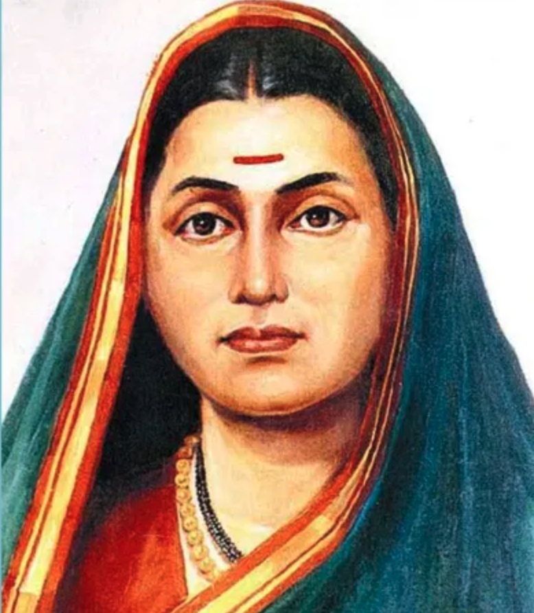{fig-alt="Sara's headshot" fig-align="center" width=250px style="border-radius: 50%;"}

#### Savitribai Phule (1831-1897) 🌺 🙏🏽🌼

:::

::: {.column width="30%"}

{width="2.0in" fig-align="center"}
:::

::: {.column width="35%"}
{fig-alt="Sara's headshot" fig-align="center" width=250px style="border-radius: 50%;"}

#### Ramabai Ambedkar (1898-1935) 🌺 🙏🏽🌼
:::
::::::

[**Savitribai Ramabai (SARA) Institute of Data Science, Sonipat**]{.r-fit-text}
:::::::

::: {.footer}
Title slide background source: [Yusuf](https://unsplash.com/@jack_aloya/illustrations)
:::

## About SARA {background-image="https://images.unsplash.com/vector-1754288532523-0f0f5e988cf5?q=80&w=1412&auto=format&fit=crop&ixlib=rb-4.1.0&ixid=M3wxMjA3fDB8MHxwaG90by1wYWdlfHx8fGVufDB8fHx8fA%3D%3D" background-size="50%" background-position="bottom right"}

> Since 2023, we believe coding is for everyone.

::: {.columns}

::: {.column width="60%"}

- Provides free open-source data science education
- Priority admission for marginalised communities & women
- Promoting AI Awareness

:::

::: {.column}

:::

:::

::: {.footer}
Image source [Afandi](https://unsplash.com/@kertiaa)
:::

## SARA Data Schools {background-color="black"}

::: {.panel-tabset}

### Summer School

::: {#fig-summer layout-ncol=2}

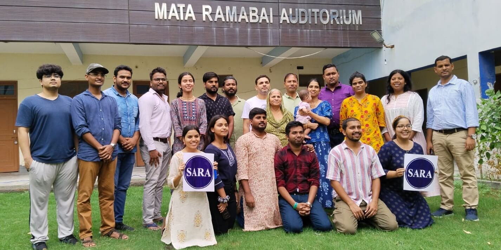{#fig-surus}

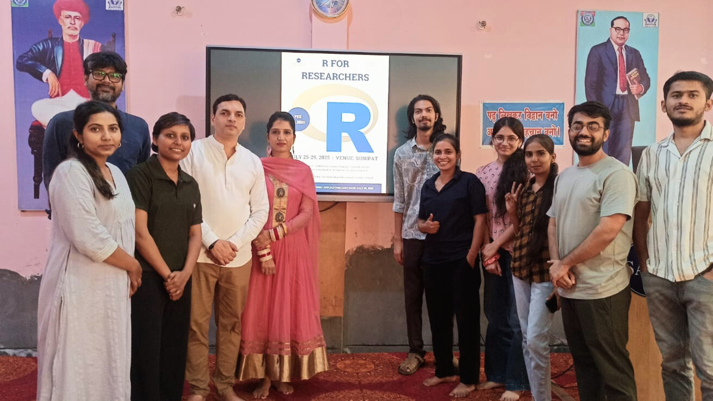{#fig-hanno}

Participants of the SARA Summer Schools "R for Researchers"
:::

### Winter School 

::: {#fig-winter layout-ncol=2}

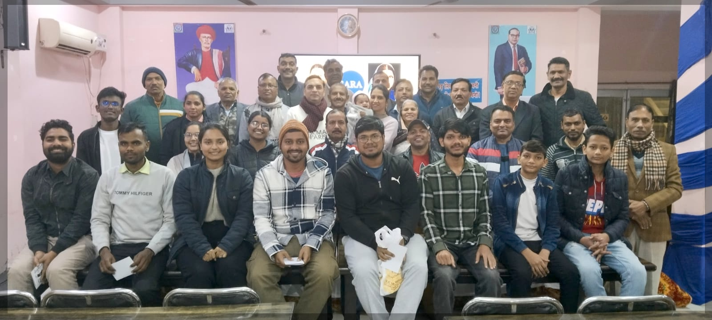{#fig-surus}

{#fig-hanno}

Participants of the SARA Winter Schools "Statistics using R"
:::

### Bootcamp

::: {#fig-bootcamp layout-ncol=2}

{#fig-surus}

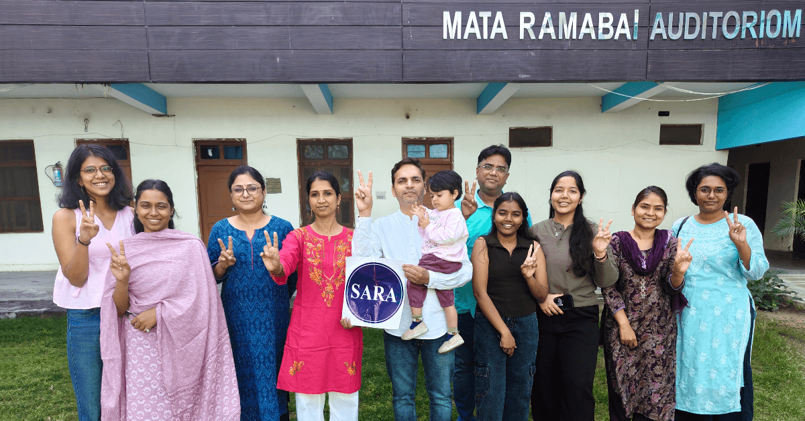{#fig-hanno}

Participants of the SARA Coding Bootcamps "Publish using Quarto"
:::

::: 
---

##  {.your-turn}

 

:::: {.centering}

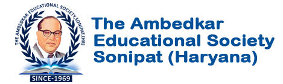

[***The Ambedkar  Educational Society Sonipat (HR)***]{.r-fit-text}

::::

::: {.footer}
Established in 1969
:::

## {background-image="images/welcome/surender.png" background-size="contain"}

# "R for Researchers"

[3rd SARA Summer School - July 2026]{.highlight}

## 3rd SARA Summer School {background-image="images/welcome/flyer.png" background-size="30%" background-position="right"}

::: {.columns}

::: {.column width="70%"}

- 5 day, 40 hours, free data science education

- All five days attendance is mandatory

- Five international pro-bono guest speakers

- 15 participants from UG to PhD level

:::

::: {.column}

:::

:::

## Teaching Modules {background-image="images/welcome/flyer.png" background-size="30%" background-position="right"}

- Day 1: Introduction to R & RStudio

- Day 2: Data import, clean, & wrangling

- Day 3: Data visualization using ggplot

- Day 4: Quantitative analysis

- Day 5: Qualitative anlaysis

::: {.footer}
Course slides [website](https://sara-course-r4b.netlify.app/)
:::

## SARA Online Guest Speakers {.r-fit-text}

::: {.layout-grid-img}

::: {.card}

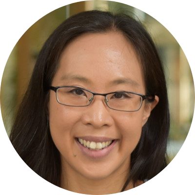

### Dr. Jessica Mar [](https://www.linkedin.com/in/jessica-mar-0386772/)
University of Queensland - AU

:::

::: {.card}

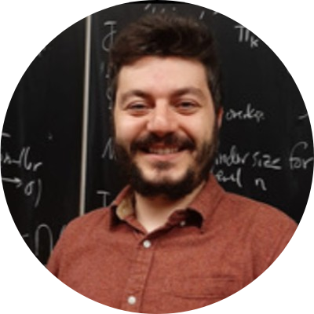

### Dr. Ozan Evkaya [](https://www.linkedin.com/in/ozanevkaya/?skipRedirect=true)
University of Edinburgh - UK

:::

::: {.card}

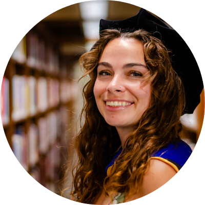

### Dr. Bailey Immel [](https://www.linkedin.com/in/bailey-immel-phd/)
Data Scientist & Researcher - USA

:::

:::

## SARA In-person Speakers

::: {.layout-grid-img}

::: {.card}

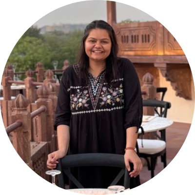

### Dr. Nikee [](https://www.linkedin.com/in/nikee-silayach-a13623231/)
CA & Manipal University - RJ

:::

::: {.card}

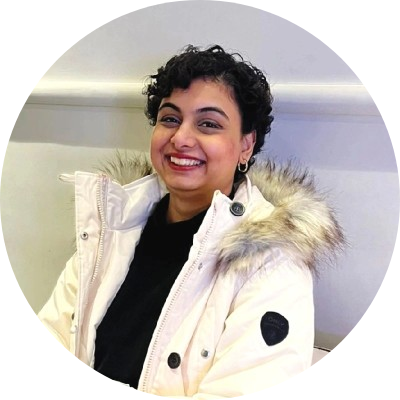

### Miss. Shivani [](https://www.linkedin.com/in/shivanisrvstv/)
Data Scientist & Researcher - DL

:::

::: {.card}

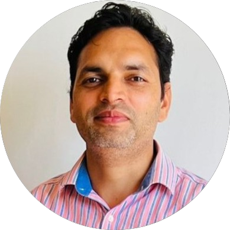

### Dr. Ajay Koli [](https://www.linkedin.com/in/ajay-kumar-koli/)
Data Educator SARA - HR

:::

:::

## SARA Summer School Participants {background-image="images/welcome/fishes.png" background-size="50%" background-position="right"}

::: {.columns}

::: {.column .r-fit-text width="30%"}

- [Vaishnavi Humane]{.fragment .highlight-blue .fade-in-then-semi-out}
- [Dr. Ashok Kumar]{.fragment .highlight-blue .fade-in-then-semi-out}
- [Rajat Kumar]{.fragment .highlight-blue .fade-in-then-semi-out}
- [Dr. G. Dhananjhay]{.fragment .highlight-blue .fade-in-then-semi-out}
- [Aishwarya Karan]{.fragment .highlight-blue .fade-in-then-semi-out}
- [Dr. Priyanka Ch.]{.fragment .highlight-blue .fade-in-then-semi-out}
- [Kajal Mahor]{.fragment .highlight-blue .fade-in-then-semi-out}

:::

::: {.column .r-fit-text}
- [Vidhata Tamgadge]{.fragment .highlight-blue .fade-in-then-semi-out}
- [Achal Bujade]{.fragment .highlight-blue .fade-in-then-semi-out}
- [Yogendra Kumar]{.fragment .highlight-blue .fade-in-then-semi-out}
- [Tushar Jadhav]{.fragment .highlight-blue .fade-in-then-semi-out}
- [Rajeshri Mandloi]{.fragment .highlight-blue .fade-in-then-semi-out}
- [Ankita Hirwani]{.fragment .highlight-blue .fade-in-then-semi-out}
- [Salman]{.fragment .highlight-blue .fade-in-then-semi-out}

:::

:::

::: {.footer}
Image source [Anna](https://unsplash.com/@annamagenta82)
:::

## Daily Schedule:

::: panel-tabset
###  Food

| Activity             | Time                        |       
|----------------------|-----------------------------|
|  Breakfast | 08:30 AM to 09:30 AM |
|  Lunch        | 01:30 PM to 02:30 PM |
|  Dinner      | 07:30 PM to 08:30 PM |

###  Lectures

| Activity         | Time                               |
|------------------|---------------------------|
| ** Class 1** | **10:00 AM to 11:30 AM**  |
|  Discussion | 30 minutes            |
| ** Class 2**  | **12:00 AM to 01:30 PM**  |
|  Lunch  | 01:30 AM to 02:30 PM  |
| ** Class 3**  | **02:30 PM to 04:00 PM**  |
|  Discussion | 30 minutes            |
| ** Class 4** | **04:30 PM to 06:00 PM**  |

:::

## Code of Conduct {.scrollable}

> ### SARA is an Ambedkarite community space. All participants are expected to uphold the values of equality, dignity, and respect throughout the summer school. 

::: {.incremental}
- [**Be Respectful & Kind**
Treat every participant, speaker, and staff member with dignity. Discrimination or disrespectful behaviour of any kind will not be tolerated.]{.fragment .fade-in-then-semi-out}

- [**Be on Time**
Attend all sessions and meals punctually. If unavoidable, inform the coordinator in advance.]{.fragment .fade-in-then-semi-out}

- [**Attend All Sessions**
Full participation is expected. Unexplained absences may result in certificate being withheld.]{.fragment .fade-in-then-semi-out}

- [**Closing at 10:00 PM**
All participants must be back in Dr. Ambedkar Bhawan by 10:00 PM every night, no exceptions.]{.fragment .fade-in-then-semi-out}

- [**Strictly Prohibited**
Smoking, alcohol, and non-vegetarian food are not allowed inside Dr. Ambedkar Bhawan.]{.fragment .fade-in-then-semi-out}

- [**Keep Spaces Clean**
Keep your room and all shared spaces clean and tidy. Damage to property is the individual's responsibility.]{.fragment .fade-in-then-semi-out}

- [**Responsible Device Use**
Use devices for learning during sessions. Do not record lectures or participants without permission.]{.fragment .fade-in-then-semi-out}

- [**Report Concerns**
Feel unsafe or witness misconduct? Report it confidentially to the organiser immediately.]{.fragment .fade-in-then-semi-out}

- [**Meals Are at Fixed Times**
Be on time for meals to avoid waste and inconvenience to the kitchen staff.]{.fragment .fade-in-then-semi-out}
:::

## Need Help! You Are Encouraged To {.scrollable} 

- [**There are no silly questions.** If you are confused, at least five others in the room are too. Your question helps everyone.]{.fragment .fade-in-then-semi-out}

- [**Raise your hand anytime during the session.** We would rather pause and explain than have you left behind.]{.fragment .fade-in-then-semi-out}

- [**If you miss a step, say so immediately.** It is easier to fix in the moment than to carry confusion forward.]{.fragment .fade-in-then-semi-out}

- [**You do not need to understand everything at once.** R takes time. Confusion is not failure - it is the beginning of learning.]{.fragment .fade-in-then-semi-out}

- [**Help your neighbour, but do not fall behind yourself.** If the person next to you is struggling, a quiet word helps - but flag to the instructor too.]{.fragment .fade-in-then-semi-out}

- [**After the session, ask freely.** Approach the instructor or volunteer during breaks, meals, or free time. We are here for you beyond the classroom too.]{.fragment .fade-in-then-semi-out}

- [**On the WhatsApp group, no question is too basic.** Post your error, your screenshot, your confusion - someone will respond.]{.fragment .fade-in-then-semi-out}

- [**If something feels uncomfortable in the classroom, tell us.** We want this to be a safe learning space. Your feedback makes us better.]{.fragment .fade-in-then-semi-out}

## 🚨 Contact Numbers:

| Name                                                       | Mobile       |
|-----------------------------|--------------|
| **SARA** Office                                            | 925 315 2024 |
| **Mr. Rajesh Kataria**, President  Dr. Ambedkar Bhawan  | 90134 99562  |
| **Mr. Surender Kumar**, Vice President  Dr. Ambedkar Bhawan  | 98132 22922  |
| **Mr. Raj Pal**, Supervisor  Dr. Ambedkar Bhawan        | 93063 42596 99917 73740  |

## 

:::::: columns
::: {.column .centering width="25%"}
   

{width=70%}
:::

::: {.column width="10%"}
:::

::: {.column  width="65%"}
 
 
   925 315 2024     
[sara.institute.info\@gmail.com](mailto:%20sara.institute.info@gmail.com)
     <https://sara-edu.netlify.app/>

  Follow SARA on Social Media. 

[](https://github.com/sara-edu)  
[](https://twitter.com/sara_institute)  
[](https://www.facebook.com/profile.php?id=61564043738390)
  [](https://www.youtube.com/@SARADataScience)
 
[](https://www.linkedin.com/company/sara-institute/)
 
[](https://whatsapp.com/channel/0029Va4r7rGLCoWycMwThl2J)
 
[](https://www.instagram.com/sara_data_sci/)
:::
::::::
